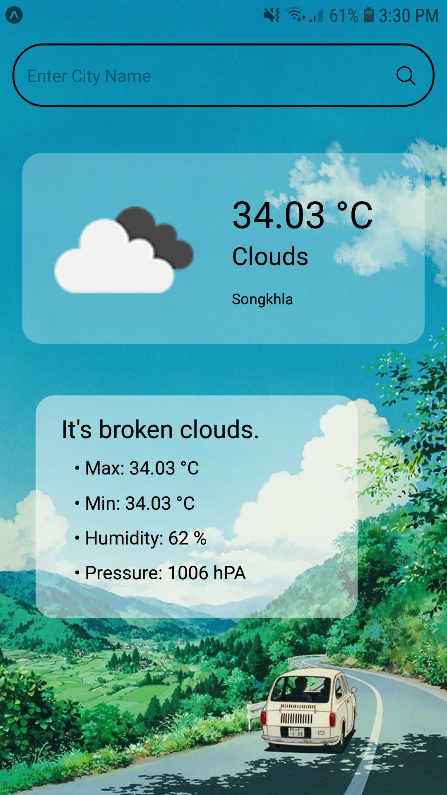
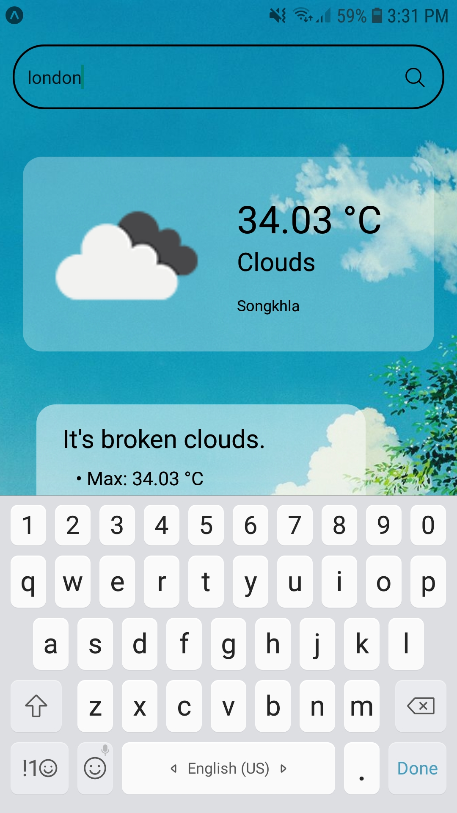
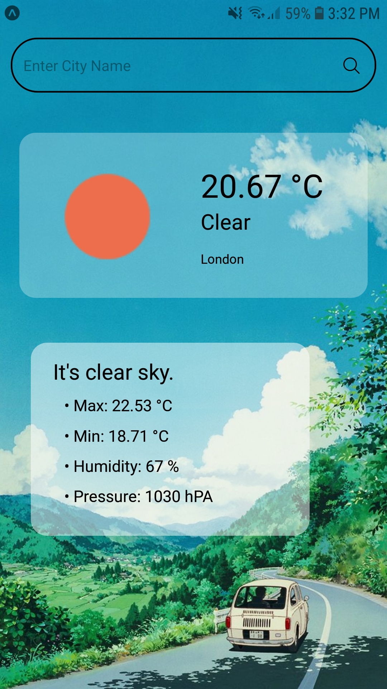

## About Me

นายวสุพจน์ ฟองมณี 6210110322 sec 01

## About Weather App

เป็นแอปแสดงสภาพอากาศของเมืองที่ต้องการ โดยมีหน้าต่างๆ ดังนี้

เมื่อเข้าแอปมา หน้าแรกขงแอปจะแสดง

### `หน้าเริ่มต้น`

ซึ่งจะแสดงข้อมูลสภาพอากาศของเมืองสงขลาเป็นค่าเริ่มต้น โดยมีการแสดงข้อมูลต่างๆ คือ
 - อุณหภูมิ
 - สภาพอากาศ
 - ชื่อเมือง
 - คำบรรยายสภาพอากาศ
 - อุณหภูมิสูงสุดและต่ำสุด
 - ความชื้น
 - ความกดอากาศ

และด้านบนสุดจะมีปุ่ม Search Bar เพื่อค้นหาเมืองที่ต้องการ สามารถพิมเมืองที่ต้องการได้

เมื่อกดค้นหา หน้าแอปจะเปลี่ยนไปแสดงข้อมูลสภาพอากาศของเมืองที่เลือก

### `ตัวอย่างเพิ่มเติม`

หากค้นหาเมืองที่ไม่มีอยู่หรือพิมไม่ถูกต้อง จะแสดง

### `หน้าไม่พบผลการค้นหา`

หน้านี้จะบอกว่า ไม่มีเมืองที่ค้นา ให้ค้นหาชื่อเมืองใหม่อีกครั้ง

โดยระหว่างโหลดข้อมูลสภาพอากาศของเมืองที่ค้นหา จะแสดง

### `หน้ากำลังโหลดข้อมูล`

## About Code

